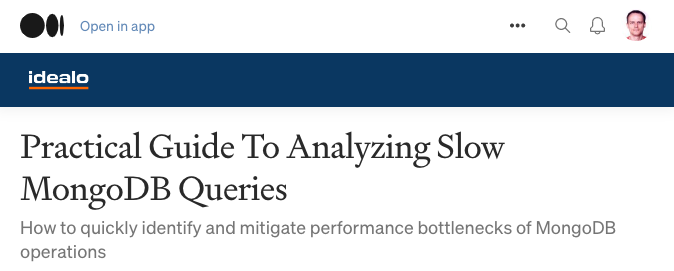
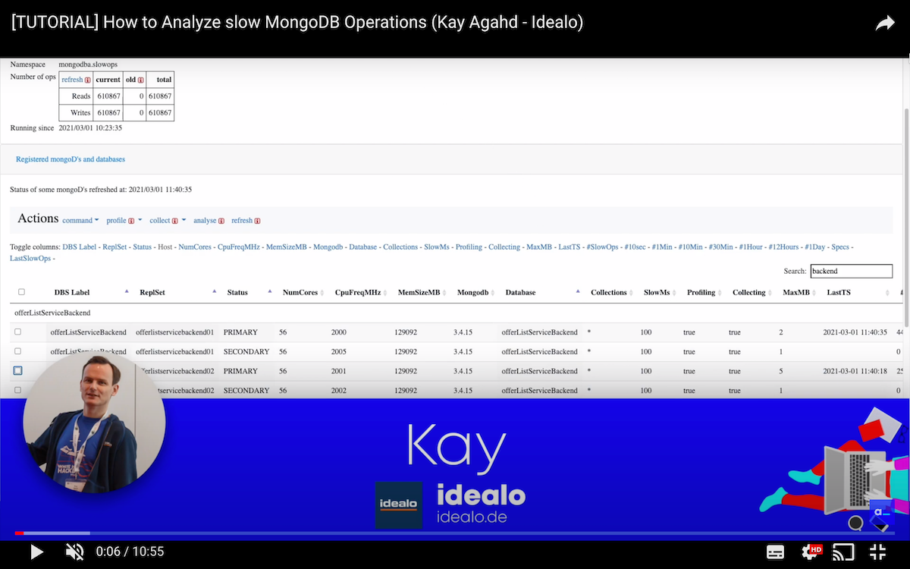

# MongoDB slow operations profiler and visualizer

This java web application collects and stores slow operations from one or more mongoDB system(s) in order to visualize and analyze them.
Since v2.0.0 it may be easily extended to an administration tool by implementing commands to be executed against the configured database system(s).
The initial version of the software has been presented during the [MongoDB User Group Berlin on 4th of June 2013](http://www.meetup.com/MUGBerlin/events/119503502/).
Slides of the presentation can be found [here](http://www.slideshare.net/Kay1A/slow-ops). Version 2.4 has been presented in November 2018 at the [Percona Live Europe Conference](https://www.percona.com/live/e18/sessions/how-to-visually-spot-and-analyze-slow-mongodb-operations).

I wrote a blog "Practical Guide To Analyzing Slow MongoDB Queries" which has been published on [medium.com](https://medium.com/idealo-tech-blog/practical-guide-to-analyze-slow-mongodb-operations-9363035b01fb):

[](https://medium.com/idealo-tech-blog/practical-guide-to-analyze-slow-mongodb-operations-9363035b01fb)

I also made a tutorial "How to Analyze slow MongoDB Operations" which has been published on [youtube.com](https://www.youtube.com/watch?v=zvQSZiTU1Zg):

[](https://www.youtube.com/watch?v=zvQSZiTU1Zg)


### Example of the analysis page

The following screenshot demonstrates how slow operations are visualized in the diagram: The higher a point or circle on the y-axis, the slower was the execution time of this operation. The greater the diameter of the circle, the more slow operations of this type were executed at this time.

You can zoom-in by drawing a rectangle with the mouse around the area you are interested in. I suggest to zoom-in **first** horizontally, and then zoom-in vertically. Press Shift + drag mouse in order to move the visible area around. Double click returns to the initial viewport.

While the mouse hovers over the diagram, the corresponding slow operations are shown in bold and details of them are displayed on the right-hand side legend. The different colors in the legend are just to better distinguish the different entries and have no further meaning.

The more "Group by" checkboxes are checked, the more details constitute slow operation types, thus the more details you'll see for each slow operation type.

For example, the following screenshot shows that only one database has been **filtered**, defined in the search form by its `Label` and `Database` name for a time span of 1 hour.
Since the slow operations are defined in the search form to be **grouped by** their collections, operations, queried and sorted fields, the legend below on the right shows these 4 details grouped together for the time period which is being hovered over by the mouse, here at 15:37 o'clock. As the the **resolution** is set to `Minute`, all slow operations occurred during within the minute hovered over by the mouse, here from 15:37 until 15:38 o'clock, are shown on the right-hand side in the legend.

The different slow operation types are printed in different colors in both the diagram and the legend. As the legend is sorted by y-axis, thus execution time in milliseconds, the **slowest** operation type is shown first. Instead, you may select "sort legend by:" `count-value` to see in the legend the **most profiled** slow operation types first (which correspond to the biggest circles).

Since the profiler was set to a threshold of 100 ms, only operations slower than 100 ms are profiled. In this screenshot, we zoomed-in to see only slow operations that were faster than 360 ms. The legend shows all slow operations that occurred at 15:37 o'clock since that's the position of the mouse pointer. The first one happened on collection `producOffer` by executing a `getmore.find` operation on both fields `_id.listIdentifier` with an `$in` operator and `_id.siteId` with an equality condition. This slow operation type occurred 86 times at this precise minute, its minimum duration was 103 ms (of all profiled operations slower than 100 ms), its maximum 1514 ms, average 354 ms and the accumulated execution time (`sum`) of all these queries during this minute was 30.465 ms.

Below you see `Returned` which informs how many documents (`min`, `max`, `avg`, `sum`, `stdDev`) were returned by this operation.
 Furthermore `Bytes` gives information about the size in bytes of the response(s). And last but not least, `R/W` shows metrics about how many index keys were read (`rKeys`), how many documents were read (`rDocs`) and written (`wDocs`) and also that no in-memory sort (`memSort`) had to be done (no sort at all in this case since no `sort` field was defined). 

The second slowest operation type in this screenshot at 15:37 o'clock is a `query` operation. Regarding its queried fields, it's the originating command of the previously described `getmore.find` operation. It occurred more often than the originating command (318 versus 86), so its circle in the diagramm is also a bit larger. 


### How to read queried, projected and sorted fields of slow operation types

The fields that make up a slow operation, such as query, projection and sort, are retrieved and stored without their exact values in the collector database. They are shown on the analysis page when analyzing slow operations as follows:
  + **queried fields** are suffixed by their operator if no equality condition was used 
     + e.g. the expression `{field:{$gt:3}}` is shown as `field.$gt` 
  + if the operator applies to **multiple operands**, operands are enclosed in square brackets 
     + e.g. the expression `$and:[$or:[a:1, b:2], c:3]` is show as `$and[$or[a, b], c]` 
  + **nested fields** are shown in dot notation 
     + e.g. the expression `$and:[{"a.x":1},{"a.y":2}]` is shown as `$and[a.x, a.y]`
  + **nested documents** are surrounded by curly braces
     + e.g. the expression `p:{x:1,y:2}` is shown as `p{x,y}`
  + **stages** of an aggregation pipeline are shown separated by semicolon
     + e.g. the pipeline `[{$match:{a:1, b:2}}, {$project:{_id: 1}}]` is shown as `'$match{a, b}'; '$project._id'`   

If you want to see an original document (from the `system.profile` collection) which corresponds to the profiled slow operation type, you need to select in the `Group By` section the following checkboxes: 
  + Label
  + Database
  + Collection
  + Operation
  + Queried fields
  + Sorted fields
  + Projected fields
  
 Once selected and submitted the form,  an [example](#) link will appear in the column `Group` in the data table below the diagram.

### Summarized table

Since v1.0.3, the user analysis page, besides the diagram, has also a table of all selected slow operation types. The
table is filterable. Columns are sortable and selectable to be hidden or shown. Wherever it makes sense, the sum of the
values of a column is displayed at the bottom of the column.

For example, to see the most expensive slow operations first, just sort descending by column `Sum ms`.

Here is a reduced screenshot of the table without any filter on rows because the `Search` textbox is empty. However not all columns are shown. You can toggle a column to be shown or hidden by clicking its name in the table header. The table here is sorted by column `Sum ms`, so we see in the first row the most **expensive** slow operation type: either there were many of this type or they were generally slow. 

Let's interpret the first row to get you familiar with. In the column `Group` you see the attributes you've grouped by (selected in the search form above). Here again, the slow ops occurred in the collection (`col`) "productOffer". The slow-op operation (`op`) was a "query". To match the documents, the field (`fields`) shows that 2 fields were used: `_id.listIdentifier` with an `$in` operator and the field `_id.siteId` with an equality condition.

Since v2.13.0, documents of profiled slow operations are stored in the collector database in order to show them as an example for any given slow operation type which may help to understand better the output of more complex queries. 
So, the column `Group` in the data table adds for each slow operation type, an [example](#) link to see an original document from the `system.profile` collection as an example of a profiled slow operation. The example matches the namespace (label, database, collection) and the query shape of the given slow operation type as long as the checkboxes `Label`, `Database`, `Collection` `Operation`, `Queried fields`, `Sorted fields` and `Projected fields` have been selected in the `Group by` section of the search form, which is not the case in the screenshot above.

The rest of the columns in the data table should be self-explanatory. High values in the column `ms/ret` (and vice versa low values in column `ret/ms`) may indicate a performance problem for operations which return documents, because these columns show the time in ms needed to return 1 document respectively the number of documents returned within 1 ms.

Since v2.14.0, slow operation examples will automatically be removed when they become older than the oldest stored slow operation e.g. if the slow ops collection is a capped collection, when the oldest entries get removed then all older example documents will be removed as well. A new example entry will be added automatically when the corresponding query is collected again. However, if such a query is not collected again, other still stored slow ops might have lost their example document if they have the same fingerprint as the removed example document.


<a name="sumtable_v2.9.0"></a>
Since version 2.9.0, the analysis page shows additional metrics about:
* number of read keys from the index (`rKeys`)
* number of read documents (`rDocs`)
* number of written documents (`wDocs`)
* if an in-memory sort happend (`memSort`)
* standard deviation of the execution times (`stdDev ms`)
* standard deviation of the number of returned documents (`stdDev ret`) 

If `rKeys` is 0 then no index has been used, resulting in a collection scan. In this case you should consider adding an index. If `rKeys`is much higher than the number of returned documents (column `Sum ret`), the database is scanning many index keys to find the result documents. Consider creating or adjusting indexes to improve query performance.

If `rDocs` is 0 then the query was "covered" which means that all information needed could be retrieved from the index, thus no document had to be fetched into memory. For write operations, if `rDocs`is higher than `wDocs`then some documents didn't need to be (re)written because they were already up-to-date.

The value of `wDocs` is the sum of how many documents have been deleted, inserted or modified by the corresponding slow operation type. This being said, you may tick **Operation**  in your **Group by** settings to know the number of written docs for the corresponding write-operation type (i.e. `remove`, `insert`, `update`).

The value of `memSort`is `true` if no index could be used to sort the documents. In this case you should consider adding or adjusting indexes so that no in-memory sort is needed anymore.

## Application status page

Since v1.0.3, there is also a page to show the application status. Besides showing the status of the collector, means where and how many slow operations have been collected (read and written) since application restart, it shows also every registered database in a table. Since profiling works per database, each database to be profiled is in one row.

The table is filterable. Columns are sortable and selectable to be hidden or shown. Wherever it makes sense, the sum of
the values of a column is displayed at the bottom of the column. The table is by default sorted by the columns `DBS Label`,
`ReplSet` and `Status` which gives a very good overview over a whole bunch of clusters. **Hint:** Hold shift key pressed
while clicking the column headers in order to sort multiple columns.

Here is a reduced screenshot of some first rows of the table, ordered by columns `DBS Label`, `Status` and `Database`, with a filter "datastore" applied on rows:


At its right side, the table has a bunch of time slot columns (10 sec, 1 min, 10 min, 30 min, 1 hour, 12 hours, 1 day). These show the number of slow operations collected during these last time periods, so you can see already here which databases may behave abnormally. In such case, you may either analyse those databases or switching off collecting  or lower their `slowMs` threshold in order to profile less slow operations.

#### Actions

Since v2.0.2, an **Actions panel** is shown always on top in order to choose actions that can be executed against the databases of selected row(s). Both `refresh` and `analyse` actions were implemented already before v2.0.0. `refresh` gets and shows the latest data of the selected database(s). `analyse` opens the above mentionned analysis page to show the slow operation types of the last 24 hours of the selected node(s) respectively database(s). Both `collecting start/stop` and `set slowMs` were also already implemented before but since v2.0.0 they are only shown to authorized users. "Authorized users" are users who used the url parameter `adminToken` set to the right value (see below under "configuration" for more details).

Since v2.0.0, you may execute **commands** against the selected database system(s). Since v2.0.3, you can choose whether the command has to run against the corresponding database system (i.e. mongoS-router) or against the individually selected nodes (i.e. mongoD). The difference is that the command will run either against the entry point of the database system (i.e. router or primary) or against all selected nodes wich may be secondaries as well. Current implemented commands are:

+ show database statistics
+ show collection statistics
+ show index access statistics (requires mongodb v3.2 or newer)
+ show currently running operations (requires mongodb v3.2 or newer)
+ show host info such as, mongodb version, operating system, kernel & libc version, CPU info (number of cores, MHz, architecture), amount of RAM, Numa enabled, page size, number of pages, max open files

The command result is shown in a new page in a filterable table. Columns are sortable as well, so you can detect immediately outliers. **Hint:** Hold shift key pressed while clicking the column headers in order to sort multiple columns.

Here is a cutout of a screenshot showing the result of the current-operation command. The table is sorted by column "secs running" in order to see slow operations first.


Implementing new commands is quite easy: just create a new java class which implements the interface `de.idealo.mongodb.slowops.command.ICommand`. The interface has only 2 methods in order to execute the database command and to transform the result to a corresponding table structure.

This being said, from v2.0.0 on, the webapp may be extended from a pure monitoring and analyzing tool to an administration tool.

#### Dynamic configurations

Since v1.2.0, authorized users may dynamically upload new configurations in order to add, remove or change databases to be registered respectively to be profiled. The configuration of the collector writer may also be changed. "Authorized users" are users, who used the url parameter `adminToken` set to the right value (see [Configuration](#config) below for more details).
The uploaded config is **not** persisted server side and will be lost upon webapp restart. 
Depending on how many changes need to be applied, especially how many `system.profile` readers are involved by the config change, it may take some seconds until the new configuration is applied.

##   Setup

### Preconditions

Either:

1. java 1.8 or newer
2. maven 2.0 or newer
3. mongoDB 2.0 or newer

Or:

1. Docker

### Starting up

#### Starting up by using Docker

1. Download both files
   [Dockerfile](https://raw.githubusercontent.com/idealo/mongodb-slow-operations-profiler/master/Dockerfile)
   and [docker-compose.yaml](https://raw.githubusercontent.com/idealo/mongodb-slow-operations-profiler/master/docker-compose.yaml) from github:
   - `curl -O
     https://raw.githubusercontent.com/idealo/mongodb-slow-operations-profiler/master/Dockerfile`
   - `curl -O
     https://raw.githubusercontent.com/idealo/mongodb-slow-operations-profiler/master/docker-compose.yaml`
2.  Being in the folder of both downloaded files, spin up the docker
    containers by issuing the command: 
    - `docker-compose up -d`
3. The application can be accessed through a web browser by the URL:
   -  [http://localhost:8080/mongodb-slow
   -operations-profiler/app?adminToken=mySecureAdminToken](http://localhost:8080/mongodb-slow-operations-profiler/app?adminToken=mySecureAdminToken)
      
      On the bottom of this page you can edit the current configuration
      and apply it by pressing the button `upload new config`
4. To visualize and analyze slow operations either select one or more
   entries and click "analyse" or use the following URL:
   - [http://localhost:8080/mongodb-slow-operations-profiler/gui](http://localhost:8080/mongodb-slow-operations-profiler/gui)
 
##### Docker does automatically the following:

* clone the project from github to your local computer in a temporary 
  docker container
* build the project by maven in a temporary docker container
* spin up one container named `collector-db` running one single mongoD
  instance serving as collector database
* spin up one container named `test-db` running one single mongoD
  instance serving as test database
* spin up one container named `profiler-webapp` running a web server (tomcat) to serve the webapp
* expose port 8080 to access the webapp

##### Some helpful Docker commands:

* access a running docker container: `docker exec -it <CONTAINER-NAME> /bin/bash` e.g. `docker exec -it test-db
  /bin/bash`
* stop a running docker container: `docker stop <CONTAINER-NAME>` e.g. `docker stop profiler-webapp`
* rebuild and start all stopped docker containers belonging to this project: `docker-compose up -d --build`
* stop all docker containers belonging to this project: `docker-compose down`
  
Be aware that neither both mongoD instances (`collector-db` and `test-db`) nor the web server (`profiler-webapp`) are
secured. This means that mongodb can be accessed without authentication from within their containers. Also SSL/TLS is
not enabled.
  
#### Starting up by having already installed git, java, maven and mongodb

1. Clone the project:
  - `git clone
     https://github.com/idealo/mongodb-slow-operations-profiler.git`
2. Enter the server addresses, database and collection names in file "`mongodb-slow-operations-profiler/src/main/resources/config.json`" (see [Configuration](#config) below)
3. While being in the in the project folder "`mongodb-slow-operations-profiler/`", build a war file by executing in a shell:
   - `mvn package`
4. Deploy the resulted war file `mongodb-slow-operations-profiler.war` on a java webserver (e.g. tomcat). Dependent on the above mentionned `config.json`, it may automatically start collecting slow operations. If no slow operations exist yet on the mongoD's, the collector(s) will sleep 1 hour before retrying.
5. The application can be accessed through a web browser by the URL:
   - [http://your-server:your-port/mongodb-slow-operations-profiler[-VERSION-NUMBER-if-less-than-2.10]/app](http://your-server:your-port/mongodb-slow-operations-profiler/app)
6. To visualize and analyze slow operations either select one or more entries and click "analyse" or use the following
   URL:
   - [http://your-server:your-port/mongodb-slow-operations-profiler[-VERSION-NUMBER-if-less-than-2.10]/gui](http://your-server:your-port/mongodb-slow-operations-profiler/gui)

### <a name="config"></a> Configuration

The application is configured by the file "`mongodb-slow-operations-profiler/src/main/resources/config.json`". It's a json formatted file and looks like this:

```json
{
  "collector":{
    "hosts":["myCollectorHost_member1:27017",
             "myCollectorHost_member2:27017",
             "myCollectorHost_member3:27017"],
    "db":"profiling",
    "collection":"slowops",
    "adminUser":"",
    "adminPw":"",
    "ssl":false
  },
  "profiled":[
    { 
      "label":"dbs foo",
      "hosts":["someHost1:27017",
               "someHost2:27017",
               "someHost3:27017"],
      "ns":["someDatabase.someCollection", "anotherDatabase.anotherCollection"],
      "adminUser":"",
      "adminPw":"",
      "collect": false,
      "ssl":false,
      "slowMS":250,
      "responseTimeoutInMs":2000
    },
    { 
      "label":"dbs bar",
      "hosts":["someMongoRouter:27017"],
      "ns":["someDatabase.someCollection", "anotherDatabase.*", "*.myCollection", "!excludedDb"],
      "adminUser":"",
      "adminPw":"",
      "collect":false,
      "ssl":false,
      "slowMS":250,
      "responseTimeoutInMs":2000,
      "systemProfileCollectionMaxSizeInMB": 64
    }
  ],
  "yAxisScale":"milliseconds",
  "adminToken":"mySecureAdminToken",
  "defaultSlowMS":100,
  "defaultResponseTimeoutInMs":2000,
  "defaultExcludedDBs": ["admin", "local", "config"],
  "maxWeblogEntries":100,
  "systemProfileCollectionMaxSizeInMB": 16
}
```
This example configuration defines first the `collector` running as a replica set consisting of 3 members on hosts "myCollectorHost_member[1|2|3]" on port 27017, using the collection "slowops" of database "profiling". Both `adminUser` and `adminPw` are empty because the mongodb instance runs without authentication. If mongoD runs with authentication, the user must exist for the admin database with role "root".

After the definition of the collector follow the databases to be profiled. In this example, there are only two entries. However, keep in mind that the application will **resolve all members** of a replica set (even if only 1 member has been defined) respectively all shards and its replica set members of a whole mongodb cluster.

Fields of `profiled` entries explained:

* `collect` = whether collecting has to be started automatically upon (re)start of the application, default=`false` (the name of this property has been renamed from `enabled` to `collect` in v3.0.0)
* `label` = a label of the database system in order to be able to filter, sort and group on it
* `hosts` = an array of members of the same replica set, or just a single host, or one or more mongo router of the same cluster
* `ns` = an array of the namespaces to be collected in the format of `databaseName.collectionName`. The placeholder `*` may be used instead of `databaseName` and/or `collectionName` to collect from all databases and/or all collections. If the placeholder `*.*` is used to profile all databases, you may prefix one or more database names with `!` in order to exclude them. Examples:
  * `databaseName.*` collects from all collections from database `databaseName`
  * `*.collectionName` collects from all databases from collection `collectionName`
  * `*.*` collects from all collections from all databases
  * `!myDB` database `myDB` will be excluded
* `adminUser`= if authentication is enabled, name of the user for database "admin" having role "root"
* `adminPw`= if authentication is enabled, passwort of the user
* `ssl`= if set to `true`, use ssl to connect to the server
* `slowMS`= threshold of slow operations in milliseconds
* `responseTimeoutInMs`= response timeout in ms
* `systemProfileCollectionMaxSizeInMB` = size in MB that the `system.profile` collection is allowed to grow. For more details see below in the version history of [v3.1.0](#v3.1.0)

The fields at root level define global or default properties: 

* `yAxisScale` = defines the scale of the y-axis in the diagram of the analysis page. It is to be set either to the value "milliseconds" or "seconds". 
* `adminToken` = has been introduced to restrict access to administrative functionalities i.e. stop/start of collecting slow operations, setting the threshold `slowMs`, seeing the currently used configuration or uploading a new configuration. To grant access to these functionalities, add the parameter `adminToken=` followed by your configured value, i.e. `mySecureAdminToken`, to the URL of the application status page, i.e. `http://your-server:your-port/mongodb-slow-operations-profiler/app?adminToken=mySecureAdminToken`.
* `defaultSlowMS` = default threshold of slow operations in milliseconds for all `profiled` entries that don't have specified `slowMS` (default: 100 ms)
* `defaultResponseTimeoutInMs` = default response timeout for all `profiled` entries that don't have specified `responseTimeoutInMs` (default: 2000 ms)
* `defaultExcludedDBs` = an array of Strings which defines databases to be excluded from profiling and collecting and thus are not shown on the application status page (see example above)
* `maxWeblogEntries` = the maximal number of log messages shown in the application status page (default: 100)
* `systemProfileCollectionMaxSizeInMB` = size in MB that the `system.profile` collection is allowed to grow. For more details see below in the version history of [v3.1.0](#v3.1.0)


## Version history

* v3.1.6
  + bugfix: data types of some metrics changed in newer versions of mongoDB which may have lead to java.lang.ClassCastException which is now fixed once for all by using generics (see [#13](/../../issues/13))  
* v3.1.5
  + bugfix: added a valid config file so that the web-app, started by docker-compose, shows its configured databases to play around with
  + improvement: the Dockerfile installs now the war-file as exploded files. This is needed when deployed in Kubernetes because the config file needs to be mounted which is not possible from within a war-file. A mounted config file allows the use of secret tokens without exposing them.
* v3.1.4
  + improvement: replace com.google.guava v26.0 by v30.0 to to close a potential security vulnerability
* v3.1.3
  + new: the table header on the analysis page has now a button `clean`. Once clicked, it will show only the most important table columns to analyze slow operations, making the table "cleaner".
* v3.1.2
  + bugfix: collecting of slow operations might have been terminated erroneously if the collecting started with an empty (or already fully consumed) `system.profile` collection **and** no new slow operations were inserted into the `system.profile` collection within the next 12 hours
* v3.1.1
  + bugfix: on the application status page, show arbiters correctly as arbiters. This did not work if authentication was enabled, because we can't authenticate on arbiters to get their replSet status due to bug https://jira.mongodb.org/browse/SERVER-5479 . The workaround is to issue the `ismaster` command which also shows the role of the mongod instance (e.g. arbiter) but does not require authentication of the client.   
<a name="v3.1.0"></a>
* v3.1.0
  + new: option `systemProfileCollectionMaxSizeInMB` has been added which allows to define the maximum size in MB for the capped collection `system.profile` (MongoDB's default is 1 MB). When profiling is activated, slow operations are first written into the `system.profile` collection of the related database and then continously read by a tailable cursor in order to copy the slow operations to the globally used collector database. However, if many huge slow operations are being read from a too small `system.profile` collection, it may happen that the tailable cursor is reset when it couldn't keep up reading because the next document the cursor was about to read has already been pushed out the capped collection by a new inserted one. If this happens and `systemProfileCollectionMaxSizeInMB` has been set to more than MongoDB's default max size of 1 MB, upon each reset of the tailable cursor, the app will successively increment the maximum size of the `system.profile` capped collection by steps of 1 MB until it reaches the max size of `systemProfileCollectionMaxSizeInMB`. 
    
    The app will not *decrease* the maximum size of the `system.profile` collection to its MongoDB default of 1 MB. However, you may drop the collection `system.profile` and the app will recreate it, beginning with a maximum size of 1 MB, as soon as collecting is activated.
    
    The rounded current maxSize of the `system.profile` collection is shown in the column `maxMB` in the table of the application status page. If it's `0`, it means that the `system.profile` does not (yet) exist or that its max size is less than 0.5 MB.  
* v3.0.3
  + improvement: new option to delete slow operation example document which might be helpful if other things than the query shape have changed (e.g. indexes), and you want to reflect them in this slow operations example document. A new example document will be re-created as soon as such an operation is collected again.
* v3.0.2
  + improvement: on the analysis page, if multiple `Labels` , `Databases` or `Collections` are entered that are wrongly separated by colon instead of semicolon, the app automatically corrects them. Also, curly braces are ignored. Since curly braces are added by [Grafana multi-value variables in text panels](https://github.com/grafana/grafana/issues/10005), it was not possible until now to create correct URL parameters `lbl`, `db` and `col` to pre-fill the search form with these values originating from Grafana. 
* v3.0.1
  + bugfix: the index access statistics may have been empty if the database had a `system.js` collection because the `$indexStats` is unauthorized to be run on `system` collections. The `system.profile` collection was already excluded from the index stats but not `system.js`. Now it is fixed, even for other collections that may be unauthorized to get index stats from.   
* v3.0.0
  + update: in the config file, the boolean property `enabled` has been renamed to `collect`. **Attention**: Please rename this property in your config file `config.json`!
  + improvement: the collector database has a new index `{lbl:1, db:1, ts:-1}` which performs for most use cases better than the previous index `{ts:-1, lbl:1}`, especially if you are profiling a lot of different database systems which have more than only 1 database. **Attention**: The app will automatically create the new index if it does not yet exist. The old index `{ts:-1, lbl:1}` will be dropped automatically. If you have upgraded from an earlier version and your collector database contains already many documents, the start-up of the app may take a while due to the index creation. The new index is created in the background so that the collector database will not get blocked during this operation. However, the app is waiting until the index has been created.
  + improvement: all search parameters are compiled to avoid injections
  + improvement: replace junit v4.12 by v4.13.1 to to close a potential security vulnerability
  + improvement: on the analysis page
    + the search tokens entered in the `Filter by` section are now transformed into regular expressions (regex) instead of plain text. For example, when the textfield `Queried fields` contains `foo;bar` then only slow operations having an equality condition on the fields `foo` or `bar` were matched up to now. From now on, it will match also slow queries whose queried fields **contain** `foo` or `bar` e.g. it would match also the queried fields `foot`, `barely` or `foo.$gt` or `$group{foot}`. This is important since operators (e.g. `$gt`, `$lt` or `$in`) are concatenated with the queried field, the `Filter by` could only find them if they were entered completely with their operators (e.g. `$gt`, `$lt` or `$in`) respectively with their pipelines (e.g. `$match` or `$group`).
    Furthermore, you can use your own regular expression within your search. For example, if you want to match slow operations that were queried on field `foo` (and not `foot`) with an equality condition (so no operator follows), just type in the regular expression `^foo$`. `^` matches the beginning and `$` matches the end of the string. 
    Keep in mind that you need to **escape** characters that are regular expression metacharacters by `\`. For example, if you want to match slow operations that were queried on field `foo` with a `$gt` condition, you cannot just write `foo.$gt` because `.` and `$` are regex metacharacters that need to be escaped by `\`, so the correct expression would be `foo\.\$gt` in this example.
    There are 3 exceptions to the usage of regular expressions:
      1. `Earliest date` and `Latest date` are always exact timestamps (no regex)
      2. `Label` and `Database` will always match dbs labels respectively database names that **begin** with the entered search string(s). If it's empty, they will match any alphanumeric word.
      3. `Millis from` and `to` are always positive integer numbers (no regex)                          
    + the per default selected `Group by` check boxes are now `Label`, `Database`, `Collection`, `Operation`, `Queried fieds`, `Sorted fieds`, and `Projected  fieds` because these allow to show example slow-operations documents
    + the default time span is from 1 hour in the past to 1 hour in the future instead of the former past 24 hours because often times we want to analyse what happened a few minutes ago respectively what is happening right now and what will happen in the near future. This is also the reason that the default `Resolution by` is now `Minute` instead of `Hour`.
    + fields of `getmore` operations contained unnecessary fields which are not relevant for the analysis so they are omitted now e.g. `$clusterTime`, `$configServerState` or `shardVersion` 
    + `getmore` operations are now specified by the suffix `.find` or `.aggregate`
    + when showing slow operations, documents contained in arrays are now correctly shown e.g. the expression `$in[{a, b}, {a, b}]` was formerly incorrectly shown as `$in[a, b, a, b]`  
    + when showing slow operations, operators (e.g. `$or`, `$and`, `$in`) are now shown in front of the tuples they are applied of instead of the end. For example, the expression `$and[a, $or[b, c]]` was formerly shown as `[a, [b, c].$or].$and` but now it's shown as `$and[a, $or[b, c]]` 
    + the `submit` button is disabled after clicking it to avoid multiple submissions
  + bugfix: some slow-operation documents were not correctly parsed if their schema did not comply with the rules of the slow-operations-profiler. This may have resulted in missing information about the queried, sorted and projected fields. For example, the `originatingCommand` of `getmore` operations, showed some unhelpful meta fields of this slow operation e.g. `'getMore'; 'collection'; 'lsid{uid, id}`  instead of showing the queried field(s), e.g. `_id` and its query operator `$gt` e.g. shown as `_id.$gt`.
  + bugfix: retrieved documents from the `system.profile` collection are now **concurrently** transformed to avoid com.mongodb.MongoQueryException: Query failed with error code 136 and error message 'errmsg: "CollectionScan died due to position in capped collection being deleted.". This error could happen when many slow operations at the same time were profiled. After having retrieved the next slow operation document from the `system.profile` capped collection, it is transformed to a compact document to store it in the global collector database. Storing the document is (and was) done concurrently but transforming was not. However, if the documents are quite big, only a few documents are present in the `system.profile` capped collection (sometimes only **one** document because the default size of the capped collection is only 1 MB!). Furthermore, the transformation of them could take too much time so that the next document in the `system.profile` collection could already be overwritten by a newer one, so the tailable cursor died. Doing the transformation concurrently alleviates this issue as long as the hardware where the slow-operations-profiler application runs has enough CPU power.
  + bugfix: in case of an error while reading the `system.profile` collection, the retry mechanism failed to reset its waiting time even though the next retry was successful. This may have resulted in retry waiting times starting from 1 second, incremented with each retry by 1 to the power of 2 up to the max of 1 hour (1, 2, 4, 8, ... 3600 sec). This retry mechanism has been designed to avoid overloading database servers with requests in case of failures. However, the error counter needs to be reset as soon as the retry was successful instead to be accumulated as it was the case until this bugfix. 
* v2.14.0
  + new: slow ops example documents are now specific to dbs label, database and collection. One the one hand this increases the quality of the examples because they are now more pertinent but on the other hand it will increase the number of example documents and memory consumption of the webserver because their fingerprints are cached in the webserver's RAM.
  + new: slow ops example documents will automatically be removed when they become older than the oldest stored slow operation e.g. if the slow ops collection is a capped collection, when the oldest entries get removed then all older example documents will be removed as well. A new example entry will be added automatically when the corresponding query is collected again. However, if such a query is not collected again, other still stored slow ops might have lost their example document if they have the same fingerprint as the removed example document.
  + update: decrease log verbosity when adding slow ops examples to the cache to reduce log file size
  + bugfix: the command `index access stats` showed the fields of compound indexes in ascending order but since in this case the order of fields matters, they are now shown in their original order   
* v2.13.0
  + new: the column `Group` of the summarized table in the analysis page adds for each row, thus for each slow operation type, a link to see an original document from the `system.profile` collection as an example of a profiled slow operation for the given slow operation type.
  + new: add $projection to the slow op document because it's important to know for the analysis if and which fields were projected
  + new: show on the analysis page also the size in bytes of the slow operation (`resplen`) which is important to understand how many bytes had to be retrieved by the database
  + new: added the possibility to hide/show with one single click a group of columns of the data table in the application status page: 
    + `Specs` toggles the columns `NumCores`, `CPUFreqMHz`, `MemSizeMB` and `Mongodb (version)`  
    + `LastSlowOps` toggles the columns `LastTS`, `#SlowOps`, `#10sec`, `#1Min`, `#10Min`, `#30Min`, `#1Hour`, `#12Hours` and `#1Day`  
  + new: added the possibility to hide/show with one single click a group of columns of the data table in the analysis page: 
    + `Durations` toggles the columns `Min ms`, `Max ms`, `Avg ms`, `Sum ms` and `StdDev ms`
    + `ReturnedDocs` toggles the columns `Min ret`, `Max ret`, `Avg ret`, `Sum ret`, `StdDev ret`, `ret/ms`, `ms/ret`
    + `Bytes` toggles the columns `Min bytes`, `Max bytes`, `Avg bytes`, `Sum bytes` and `StdDev bytes`
  + update: the negative y-axis on the analysis page shows only up to negative 10% of the maximum y-value, because there are never negative values and the circles near zero are still clearly visible
* v2.12.0
  + new: overhaul of the application status page to make it look cleaner and more modern
  + new: the command `db stats` has been added to the application status page. The command shows statistics about the selected databases such as `objects`, `avgObjSize`, `dataSize`, `storageSize`, `#indexes` and `indexSize`.
  + new: the command `list db.collections` has been replaced by `collection stats` which shows more details about the collection(s) such as `size`, `count`, `avgObjSize`, `storageSize`, `#indexes`, `totalIndexSize` and sizes of each index. 
  + new: the command `index access stats` adds a column to the result table in order to show whether the index is a TTL index or not. 
    This is important to know because as [mongodb documentation](https://docs.mongodb.com/master/reference/operator/aggregation/indexStats/#behavior) states, the statistics only include index accesses driven by user requests. It does not include internal operations like deletion via TTL indexes.
    So if a given index shows 0 accesses it may be still a useful index if it's used as TTL index.  
  + new: until now commands were executed against *all* databases of the selected DBS but now they will only be run against the database(s) of the selected rows.
    For example, the command `index access stats` was executed for all collections of all databases of the DBS (respectively mongoD) of the selected row even if only one row, thus only one database, had been selected.
    This behaviour could have produced very long results, may have added avoidable stress to the DBS and was slower than just getting the result of the selected database(s).
    However, there may be commands such as `host info` for example which are not bound to a specific database, so the result is still bound to the DBS (respectively host) independent of the *specific* selected database(s). 
  + new: favicon for all web pages added
  + new: for collected insert operations, the inserted document is removed from the slow ops document because it may be quite huge and it does not matter for the analysis, and most important, it may produce lots of different slow-op types only because there may be many different inserted document structures 
* v2.11.0
  + new: configuration option `defaultExcludedDBs` which defines databases to be excluded from profiling and collecting and thus are not shown on the application status page (see example above)
  + new: in the configuration file you may prefix database names with `!` to exclude them from profiling/collecting which is helpful in combination with the database.collections placeholder `*.*` 
  + new: for collected update operations, the updated document is removed from the slow ops document because it may be quite huge and it does not matter for the analysis, and most important, it may produce lots of different slow-op types only because there may be many different updated document structures 
  + new: in the analysis page, in the column `Resolution by` the option `Second` was added, which allows a finer grained analysis. However, only use a fine grained resolution if the selected time period is short enough to return data that fit in the maximum allowed BSON document size (16 MB).
  + new: some info tooltips have been added
* v2.10.2
  +  update: the action `current ops` shows the originating command (if it exists) because getMore operations will just
     show the cursor id in the `command` field whereas the field `originating command` contains the queried fields which
     are more interesting to know than the cursor id
* v2.10.1
   + bugfix: when uploading a new collector configuration, the number of written slow operations was set to 0, so the total number of written slows ops was also incorrectly shown in the statistics of the collector on the application status page
* v2.10.0
   +  new: `Dockerfile` and `docker-compose.yaml` added which allows to spin up both the webapp and the collector
      database in docker containers. Only Docker needs to be installed to run the application in this way. All the other
      dependencies (git, java, maven, mongodb) will be handled by Docker automatically and thus don't have to be set up
      by the user.
   + new: change default `config.json` so that Docker can use it right away
   + new: show status of single nodes as SINGLE (instead of UNKNOWN)
   + new: show log message in the application status page when the profiling writer was started or stopped 
   + update: version number is omitted in war file so that the URL to access the webapp stays the same when the version number changes
* v2.9.0
   + new: for `getmore` operations the profiler analyzes `originatingCommand` from the profiling entries, so `getmore` operations can now be related to the originating query (only for mongodb versions 3.6 and newer)
   + new: the profiler retrieves additional fields from the profiling entries such as `keysExamined`, `docsExamined`, `hasSortStage`, `ndeleted`, `ninserted` and `nModified` (don't blame me for the inconsitent camel case - it's mongodb.org's carelessness). The first three fields are available only for monogdb versions 3.2 and newer. 
   + update: in the analysis page, the legend of the diagram is reformatted for better readability
   + new: the analysis page shows additional metrics about:
     * number of read keys from the index (`rKeys`)
     * number of read documents (`rDocs`)
     * number written documents (`wDocs`)
     * if an in-memory sort happened (`memSort`)
     * standard deviation of the execution time (`StdDev ms`)
     * standard deviation of the number of returned documents (`StdDev ret`)

     For more details [see above](#sumtable_v2.9.0)
   + bugfix: on the analysis page in `Filter by`, searching for `Queried fields` or `Sorted fields` may have required special formatting in order to match these fields, mainly for embedded or complex fields, but now, queried and sorted fields can be copied as they are shown in the analysis page and pasted "as is" in the search form `Filter by` to filter by them    
* v2.8.0
   + new: slow operation query fields having sub documents are clearer noted i.e. a query like `field:{foo:{bar:3,baz:5}}` was formerly shown as `field.foo.bar.baz` but now it's `field.foo{bar,baz}`. The same goes for operators as for example `$elemMatch`: a query like `field:{$elemMatch:{foo:1, bar:2, baz:{$gt:3}}}` was formerly shown just as `field.$elemMatch` but now it's `field.$elemMatch{baz.$gt,foo,bar}`
   + update: the in v2.7.0 introduced recursively field detection is improved i.e. a query like `{$and:[{x:3},{$or:[{y:5},{z:7}]}]}` was shown in v2.7.0 as `x|y|z.$or.$and` but now it's `[x,[y,z.$or].$and]` in order to clearly point out which operator belongs to which field(s)
* v2.7.0
   + new: slow operation query fields are now recursively detected i.e. a criterion of a query like `{$and:[{x:3},{$or:[{y:5},{z:7}]}]}` was formerly shown just as `$and` (only 1 level deep) but now, also deeper nested levels are shown, e.g. `x|y|z.$or.$and`
   + new: the fingerprint of a query is better distinguished i.e. a query like `{field:{$or:[{x:3},{y:5}]}}` was formerly fingerprinted just as `$or` but now it's `field.$or` which is helpful to spot queries using operators which may cause performance issues
   + new: write slow operations into the collector database by using batches (BulkWrites), which increases the insert rate and consumes less resources
   + new: on the application status page show a log message if the system.profile collection could not be read fast enough because the insertion rate of slow operations was too high or the system.profile collection too small, so decrease the operations to be profiled (e.g. by lowering the slowMs threshold) and/or increase the size of system.profile collection
* v2.6.1
   + bugfix: removed debug code for the application status page which resulted in a MemSizeMB value incremented by 1
* v2.6.0
   + new: clicking "upload new config" in the application status page will resolve all members of all defined database systems. So use this functionality also if shards or replica set servers have been removed or added and your configured access points are unchanged.
   + update: only one instance of `MonogClient` per server:port and its configured settings (timeouts, ssl, user/pw etc.) is used and won't be closed after usage so connections can be pooled and re-used
   + update: tried to show status of arbiters running with authentication which is not possible due to a mongodb bug [SERVER-5479](https://jira.mongodb.org/browse/SERVER-5479) though. Therefore, connecting to arbiters is not possible hence the status `UNKNOWN` is still shown.
   + update: condensed monitoring log output
   + update: java mongodb driver updated from v3.8.0 to v3.10.2
* v2.5.2
   + bugfix: `current op` command did not work properly for some mongodb versions because the format of field `secs_running` could be either of type `Long` or `Integer`
   + bugfix: the data table of the application status page displayed the host info only for the first database entry for each host
* v2.5.1
   + new: data table of the application status page has added some important host info such as CPU frequency, number of cores, amount of RAM and mongodb version. This is helpful if you want to check at a glance many servers or even clusters if they differ in some important specifications or configurations.
   + new: command "host info" added to action panel in order to show even more info about the host
* v2.5.0
   + new option: a boolean `ssl` (default: `false`) for `collector` and `profiled` entries in order to connect using ssl
   + bugfix: `index access stats` command did not work anymore for newer versions of mongodb because some databases (admin, config, local) and collections (system.profile) are not allowed to be targeted
   + bugfix: `current op` command did not work for newer mongodb versions because the output format has changed. This is also the reason that the whole `command` is now shown instead of `query`. The latter seems to be obsolete for newer mongodb versions. `command` is much more verbose than `query` and may/should be itemized in the future to fit better the tabular structure. The `command` output is json-formatted as before done with `query`.
* v2.4.2
   + update: log at the bottom of the application status page when thread pool is going to be closed after max. response timeout although not all threads have terminated. This may be especially relevant if many mongoDB systems with many databases are to be profiled because for each of them one thread is getting server status updates (e.g. if the database profiler is running or stopped). However, if the webserver is limited in CPU cores, it can't handle all threads in parallel within the given max. response timeout. In such cases the user is now informed that not all threads could terminate, and hence the application status page might be incomplete. Adding more CPU cores, incrementing the max. response timeout (see options `responseTimeoutInMs` and `defaultResponseTimeoutInMs`) or profiling quicker responding or fewer mongoDB servers will alleviate or even avoid this issue.
* v2.4.1
   + bugfix: replica sets got not resolved (only sharded clusters and single nodes got resolved)
   + update: limit number of threads dependent on number of cores when using thread pools
   + update: default sorting of columns corresponds to the order of the columns from right to left: "label, replSet, status, host, database" instead of the former column sort order "label, replSet, host, status, database"
* v2.4.0
   + bugfix: the data table of the application status page could sometimes not be loaded du to race conditions and resultant deadlocks
   + new: user relevant log messages (see new option `maxWeblogEntries`) are shown at the bottom of the application status page, which is helpful for example to spot mongoD hosts that could not sent a response within the configured `responseTimeoutInMs`
   + new: option `responseTimeoutInMs` which is helpful to fail fast (thus to show the application status page quick enough) when some defined mongo hosts are not responsive enough
   + new: option `defaultResponseTimeoutInMs` defines a default response timeout for all `profiled` entries that don't have specified `responseTimeoutInMs`
   + new: option `defaultSlowMS` has been introduced to define a default threshold of slow operations in milliseconds for all `profiled` entries that don't have specified `slowMS`
   + new: option `maxWeblogEntries` has been introduced to define the maximal number of log messages shown at the bottom of the application status page
   + update: the cache layer, introduced in v2.1.0 in order to load the application status page quicker, has been removed because it's more accurate to see actual than outdated cached values. Thanks to the new option `responseTimeoutInMs`, the application status page should be displayed within at most 2 times of the longest defined `responseTimeoutInMs` plus data transfer time.
   + update: line number added in log line
   + update: mongodb driver v3.8.0
* v2.3.0
   + new: namespace (`profiled.ns`) in config.json may use placeholder `*` for databse names (i.e. `*.myCollection`) in order to collect from myCollection from all databases
* v2.2.1
   + bugfix: the initial viewport of the diagram did not always cover the whole x-axis range
* v2.2.0
   + new: the diagram of the analysis page has now new options to redraw the y-axis either as avg, min, max or sum of the duration of the slow operation types, to easily spot spikes
   + update: localized formatting of numbers in the legend of the diagram and in the summarized table of the analysis page
   + update: option "exclude 14-days-operations" removed because newer versions of mongodb have fixed this
   + bugfix: labels of slow operations types in the legend of the diagram were mixed-up since last version v2.1.1
   + bugfix: the legend of the chronologically very first slow operation types was not shown next to the diagram
* v2.1.1
   + bugfix: the diagram displayed superfluously also the accumulation of all distinct slow operation types, resulting in big circles at the first occurrence of each distinct slow operation type, thus often shown at the very left on the x-axis
   + bugfix: after refreshing the application status page, the status of profiling, collecting and slowMs of nodes whose status changed within the cache time of 1 minute might have been wrongly reported because these values were not immediately updated in the cache
* v2.1.0
   + new: application status page loads much quicker if many mongoD's or databases are registered because the status of mongoD's and databases are now cached; a page reload will refresh the status of mongoD's and databases in the background if it's older than 1 minute
* v2.0.3
   + new: option to run command against database system or against selected nodes
* v2.0.2
   + new: action panel is now floating on top so it's always visible which avoids scrolling down the whole page to use it
* v2.0.1
   + new: preset search filter on application status page with value of url parameter `lbl`
* v2.0.0
   + new: show tabular result of commands executed against the selected database system(s); implemented commands are:
     + show current running operations
     + list databases and their collections
     + show index access statistics of all databases and their collections (requires mongodb v3.2 or newer)
   + new: grant access to administrative functionalities only to authorized users
   + update: use mongodb-java-driver v3.4.2 instead of previously used v3.3.0
   + update: for consistent reads `ReadPreference.primaryPreferred()` is used instead of previously used `ReadPreference.secondaryPreferred()` - except for analysing collected slow operations which still uses `ReadPreference.secondaryPreferred()`
* v1.2.1
    + bugfix: removing profiling reader(s) when uploading a new config might have failed
    + update: both parameters fromDate and toDate are required on analyse page and will be set to default if not existent; other given parameters are applied independently
    + update: change index from {adr:1, db:1} to {adr:1, db:1, ts:-1} on profiling.slowops collection to accelerate start-up of profiling readers when they query for their newest written entry in order to continue from
    + update: change index from {ts:-1} to {ts:-1, lbl:1} on profiling.slowops collection to speed-up analyse queries having also "lbl" ("ts" is always provided)
* v1.2.0
    + new: show currently used configuration as json
    + new: upload new configuration as json (which is applied but not persisted server side); all servers of changed "profiled"-entries are (re)started; collector is restarted if its config changed
    + new: option to refresh only collector status
    + new: show number of reads and writes from current and removed/changed profilers and the collector which helps to see if all reads of the profilers got written by collector
    + update: socket timeout for analyze queries set from 10 to 60 seconds
* v1.1.2
    + bugfix: the sum on columns was not updated when rows were filtered on analysis page
    + new: column `ms/ret` in table on analysis page added which shows how much time was globally spent for one returned document
* v1.1.1
    + new: when using placeholder `*` to collect from all collections, exclude documents of namespace `db.system.profile` because reading from `db.system.profile` may be slower than defined by slowMS, resulting in a new entry in `db.system.profile` which is irrelevant for the analysis
* v1.1.0
    + new: namespace (`profiled.ns`) in config.json may use placeholder `*` for collection names (i.e. `mydb.*`) in order to collect from all collections of the given database
* v1.0.3
    + new: multiple databases and collections for different replica sets, clusters or single mongoD's can be defined to be profiled
    + new: automatic resolving of all mongoD's constituting the defined clusters and replica sets
    + new: overview of all resolved mongoD's and their state i.e. primary or secondary, databases, being profiled or not, number of profiled slow operations per database in total and in the last time periods of 10 seconds, 1, 10, 30 minutes, 1, 12 and 24 hours
    + new: option to set `slowMs` threshold, to start or to stop profiling and collecting of slow operations for multiple selected databases with one click
    + new: just tick one or multiple databases to open the diagram showing slow operations graphically for the selected databases, mongoD's, replica sets or whole clusters
    + new: besides the diagram showing slow operation graphically, a filterable and sortable table displays different metrics of these slow operations, so you can easily spot the most expensive operations within the chosen time period
    + new: option to show circles in the diagram as square root of count-value to reduce the diameter of the circles which is useful when there are too many slow operations of the same type resulting in circles which are too large to fit in the diagram
    + new: the fingerprint of a query is better distinguished i.e. a query like `{_id:{$in:[1,2,3]}}` was formerly fingerprinted just as `_id` but now it's `_id.$in` which is helpful to spot queries using operators which may cause performance issues
    + new: better identification of `command` i.e. `command` can be `count`, `findAndModify`, `distinct`, `collStats`, `aggregate` etc. which was formerly not itemized, so instead of seeing just `command` you see now `command.count` for example
    + new: better itemizing of aggregations, i.e. two pipelines `match` and `group` may be itemized as for example: `[$match._id, $group.city]` which makes identifying different aggregations easier
    + new: using java 1.8
* v0.1.1
    + new: sort legend by count or y-value
    + update: Eclipse's Dynamic Web Module facet changed from v2.5 to v3.0 (changes web-app tag in web.xml)
* v0.1.0
    + new: filter by date/time
    + new: filter by millis
    + change: deprecated tags removed from logback configuration
    + bugfix: respect time zone and day light saving time (data are still saved in GMT but now displayed dependent on time zone and day light saving time)
    + bugfix: zoom into graph could have resulted in a blank graph due to conflict with the previous date picker javascript library
    + bugfix: date formatting is now thread safe
* v0.0.2
    + logback configuration file
    + maven-war plugin update
* v0.0.1
    + initial release


## Third party libraries

* mongo-java-driver: [Apache License 2.0](http://www.apache.org/licenses/LICENSE-2.0.html)
* slf4j: [MIT License](http://opensource.org/licenses/MIT)
* logback: [LGPL 2.1](http://www.gnu.org/licenses/old-licenses/lgpl-2.1)
* google-collections (Guava): [Apache License 2.0](http://www.apache.org/licenses/LICENSE-2.0.html)
* jongo: [Apache License 2.0](http://www.apache.org/licenses/LICENSE-2.0.html)
* jackson: [Apache License 2.0](http://www.apache.org/licenses/LICENSE-2.0.html)
* bson4jackson: [Apache License 2.0](http://www.apache.org/licenses/LICENSE-2.0.html)
* dygraph: [MIT License](http://opensource.org/licenses/MIT)
* bootstrap-datetimepicker: [Apache License 2.0](https://github.com/tarruda/bootstrap-datetimepicker)


## License

This software is licensed under [AGPL 3.0](http://www.gnu.org/licenses/agpl-3.0.html).
For details about the license, please see file "LICENSE", located in the same folder as this "README.md" file.


