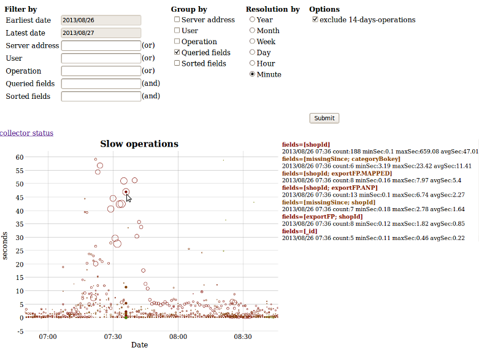

----------------------------------------------------
   MongoDB slow operation profiler and visualizer
----------------------------------------------------

This java web application collects slow operations from a mongoDB system in order to visualize and analyze them.
The software has been presented during the [MongoDB User Group Berlin on 4th of June 2013](http://www.meetup.com/MUGBerlin/events/119503502/).
Slides of the presentation can be found [here](http://www.slideshare.net/Kay1A/slow-ops).

---------------------------------------
   Screenshot of the User-Interface
---------------------------------------

-----------
   Setup
-----------

Preconditions:

1. java 1.6 or newer
2. maven 2.0 or newer
3. mongoDB 2.0 or newer
4. enable profiling on all your mongod's you want to profile

Starting up:

1. Checkout/clone the project
2. Enter the server addresses, database and collection names in file "mongodb-slow-operations-profiler/src/main/resources/config.properties"
3. While being in the in the project folder "mongodb-slow-operations-profiler/", build a war file by executing in a shell: mvn package
4. Deploy the resulted war file (e.g. "mongodb-slow-operations-profiler-0.0.1-SNAPSHOT.war") on a java webserver (e.g. tomcat), it will automatically start collecting slow operations. If no slow ops exist, the collector(s) will sleep 1 hour before retrying.
5. Read/write status of collecting slow operations can be seen here: http://your-server:your-port/mongodb-slow-operations-profiler-0.0.1-SNAPSHOT/status
6. Visualize and analyze slow operations here: http://your-server:your-port/mongodb-slow-operations-profiler-0.0.1-SNAPSHOT/gui

---------------------
   Version history
---------------------

* v0.0.2
    + logback configuration file
    + maven-war plugin update
* v0.0.1
    + initial release

---------------------------
   Third party libraries
---------------------------

* mongo-java-driver: [Apache License 2.0](http://www.apache.org/licenses/LICENSE-2.0.html)
* slf4j: [MIT License](http://opensource.org/licenses/MIT)
* logback: [LGPL 2.1](http://www.gnu.org/licenses/old-licenses/lgpl-2.1)
* google-collections (Guava): [Apache License 2.0](http://www.apache.org/licenses/LICENSE-2.0.html)
* jongo: [Apache License 2.0](http://www.apache.org/licenses/LICENSE-2.0.html)
* jackson: [Apache License 2.0](http://www.apache.org/licenses/LICENSE-2.0.html)
* bson4jackson: [Apache License 2.0](http://www.apache.org/licenses/LICENSE-2.0.html)
* dygraph: [MIT License](http://opensource.org/licenses/MIT)

--------------
   License
--------------

This software is licensed under [AGPL 3.0](http://www.gnu.org/licenses/agpl-3.0.html).
For details about the license, please see file "LICENSE", located in the same folder as this "README.md" file.

