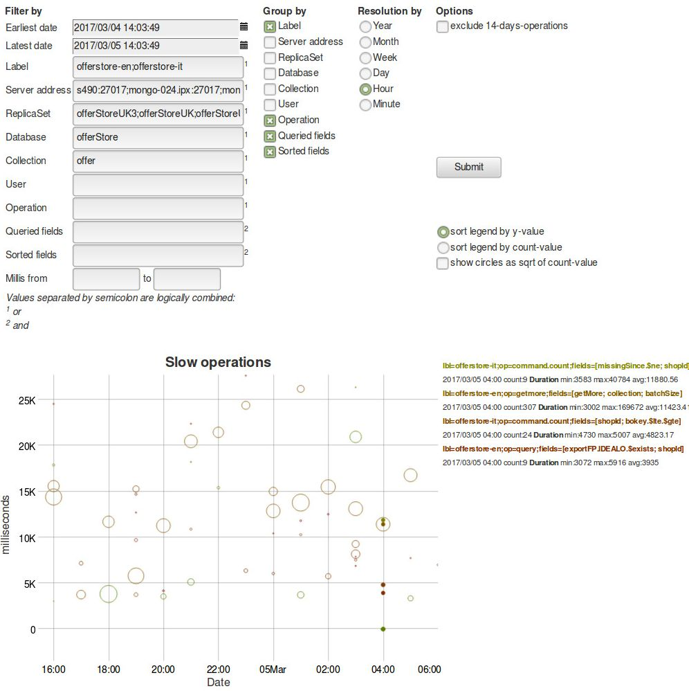
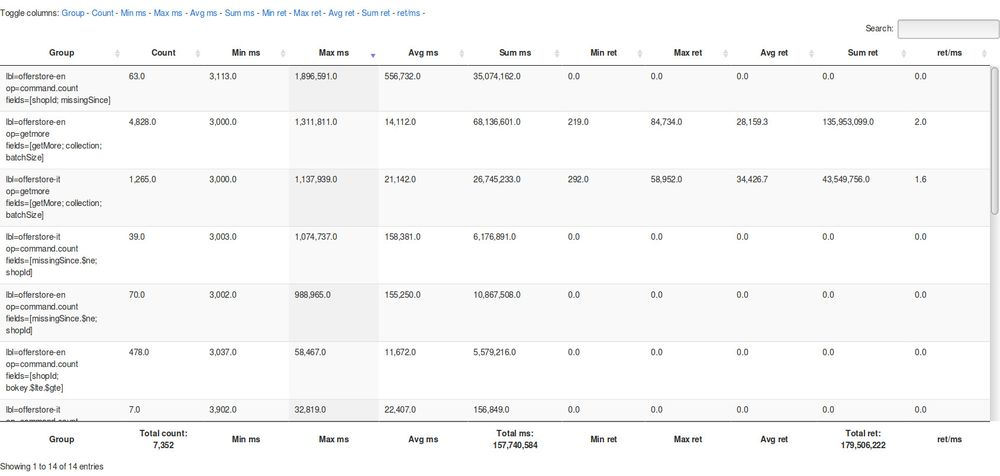
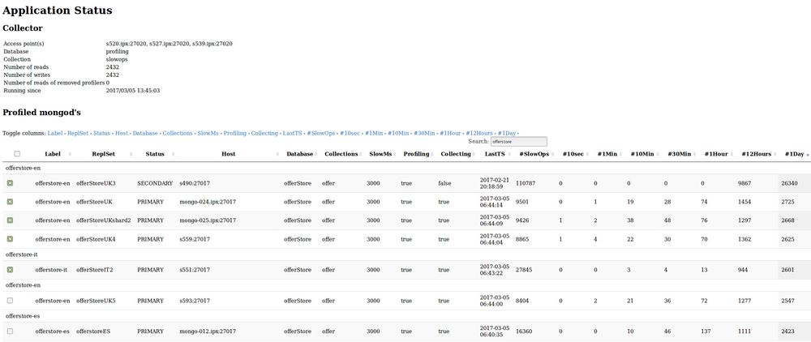
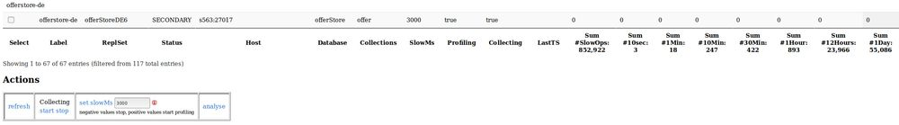

# MongoDB slow operation profiler and visualizer

This java web application collects slow operations from a mongoDB system in order to visualize and analyze them.
The software has been presented during the [MongoDB User Group Berlin on 4th of June 2013](http://www.meetup.com/MUGBerlin/events/119503502/).
Slides of the presentation can be found [here](http://www.slideshare.net/Kay1A/slow-ops).

The following first screenshot demonstrates how slow operations are visualized in the diagram: The higher a point or circle on the y-axis, the slower was the execution time of this operation. The greater the diameter of the circle, the more slow operations of this type were executed at this time. 

You can zoom-in by drawing a rectangle with the mouse around the area you are interested in. I suggest to zoom-in **first** horizontally, just y>=0, and then zoom-in vertically. Double click leaves the zoom mode.

While the mouse hovers over the diagram, the corresponding slow operations are shown in bold and details of them are displayed on the right-hand side legend. The different colors in the legend are just to better distinguish the different entries and have no further meaning.

The more "Group by" checkboxes are checked, the more details constitute slow operation types, thus the more details you'll see for each slow operation type.


### Example

For example, the following screenshot shows that only a few databases have been **filtered**, defined by their labels, server address, replica set name, database and collection for a specific time period of one day. 
Since they are **grouped by** their label, operation, queried and sorted fields, the legend below on the right shows these 4 details grouped together for the time period which is being hovered over by the mouse, here at 04:00 o'clock. As the the **resolution** is set to `Hour`, all slow operations occurred during within the hour hovered over by the mouse, here from 04:00 until 04:59.59 o'clock, are shown.

In this example, during 1 hour from 04:00 o'clock occurred 4 different slow operation types, two on `offerstore-it` and two on `offerstore-en`. As the legend is sorted by y-axis, thus duration, the slowest operation type is shown first. 

The slowest operation type happened on `offerstore-it` by executing a `count` command on both fields `missingSince`, using an `$ne` expression, and field `shopId`, using a concrete value. This slow operation type occurred 9 times, its minimum duration was 3,583 ms, its maximum 40,784 ms and its average 11,880.56 ms. 

The second slowest operation type happened on `offerstore-en` by fetching a next batch (op=`getmore`). The queried fields are unknown for a getmore operation but the query itself, including its used fields, may have been recorded earlier already because there is no reason that the query itself has been faster than its followed getmore operation.

The third slowest operation type happened on `offerstore-it` by executing a `count` command on both fields `shopId`, using a concrete value, and on field `bokey` using a range query with both operators `$lte` and `$gte`.

The fourth and last slowest operation type in this example from 04:00 until 04:59 o'clock happened on `offerstore-en` by executing a query on both fields `exportIFP.IDEALO`, using an `$exists` operator and on field `shopId`, using a concrete value.


## Example screenshot of the analysis page




### Summarized table

Since v1.0.3 the user analysis page, besides the diagram, has also a table of all selected slow operation types. The table is filterable. Columns are sortable and selectable to be hidden or shown. The sum over the values of columns, where it makes sense, is shown at the bottom of the columns.

For example, to see the most expensive slow operations first, just sort descending by column `Sum ms`.

Here is a reduced screenshot of the table where all columns are shown, sorted by column `Max ms`, without any filter on rows.




## Applicaton status page

Since v1.0.3 there is also a page to show the application status. Besides showing the status of the collector, means where and how many slow operations have been collected (read and written) since application restart, it shows also every database to be profiled in a table. Since profiling works per database, each database to be profiled is in one row.

The table is filterable. Columns are sortable and selectable to be hidden or shown. The sum over the values of columns, where it makes sense, is shown at the bottom of the columns. The table is by default sorted by the columns `Label`, `ReplSet` and `Status` which gives a very good overview over a whole bunch of clusters. **Hint:** Hold shift key pressed while clicking the column headers in order to sort multiple columns.

Here is a reduced screenshot of the 7 first rows of the table, ordered by column `#1Day`, with a filter "offerstore" applied on rows:



The table has a bunch of time slot columns (10 sec, 1 min, 10 min, 30 min, 1 hour, 12 hours, 1 day). These show the number of slow operations collected during these last time periods, so you can see already here which databases may behave abnormally. In such case, you may either analyse those databases or switching off collecting  or lower their `slowMs` threshold in order to profile less slow operations.

Below the table is the **Actions panel** in order to switch collecting on/off, to change the slowMs threshold or to analyse  the selected databases with one click on the fly:



By clicking on `analyse`, the above mentioned analysis page will show the slow operation types of the last 24 hours of the selected rows, here the 5 first rows are selected.

##   Setup

### Preconditions

1. java 1.8 or newer
2. maven 2.0 or newer
3. mongoDB 2.0 or newer

### Starting up

1. Clone the project:   
`git clone https://github.com/idealo/mongodb-slow-operations-profiler.git`
2. Enter the server addresses, database and collection names in file "`mongodb-slow-operations-profiler/src/main/resources/config.json`" (see [Configuration](#config) below)
3. While being in the in the project folder "`mongodb-slow-operations-profiler/`", build a war file by executing in a shell:  
`mvn package`
4. Deploy the resulted war file (e.g. "`mongodb-slow-operations-profiler-1.0.3.war`") on a java webserver (e.g. tomcat). Dependent on the above mentionned `config.json`, it may automatically start collecting slow operations. If no slow operations exist yet on the mongod's, the collector(s) will sleep 1 hour before retrying.
5. The application can be accessed through a web browser by the URL `http://your-server:your-port/mongodb-slow-operations-profiler-[your-version]/app`
6. To visualize and analyze slow operations either select one or more entries and click "analyse" or use the following URL `http://your-server:your-port/mongodb-slow-operations-profiler-[your-version]/gui`

### <a name="config"></a> Configuration

The application is configured by the file "`mongodb-slow-operations-profiler/src/main/resources/config.json`". It's a json formatted file and looks like this:

```json
{
  "collector":{
    "hosts":["myCollectorHost_member1:27017",
             "myCollectorHost_member2:27017",
             "myCollectorHost_member3:27017"],
    "db":"profiling",
    "collection":"slowops",
    "adminUser":"",
    "adminPw":""
  },
  "profiled":[
    { "enabled": false,
      "label":"foo",
      "hosts":["someHost1:27017",
               "someHost2:27017",
               "someHost3:27017"],
      "ns":["someDatabase.someCollection", "anotherDatabase.anotherCollection"],
      "adminUser":"",
      "adminPw":"",
      "slowMS":250
    },
    { "enabled": false,
      "label":"bar",
      "hosts":["someMongoRouter:27017"],
      "ns":["someDatabase.someCollection", "anotherDatabase.*"],
      "adminUser":"",
      "adminPw":"",
      "slowMS":250
    }
  ],
  "yAxisScale":"milliseconds"
}
```
This example configuration defines first the `collector` running as a replica set consisting of 3 members on hosts "myCollectorHost_member[1|2|3]" on port 27017, using the collection "slowops" of database "profiling". Both `adminUser` and `adminPw` are empty because the mongodb instance runs without authentication. If mongod runs with authentication, the user must exist for the admin database with role "root".

After the definition of the collector follow the databases to be profiled. In this example, there are only two entries. However, keep in mind that the application will **resolve all members** of a replica set (even if only 1 member has been defined) respectively all shards and its replica set members of a whole cluster.

Fields of `profiled` entries explained:

* `enabled` = whether collecting has to be started automatically upon (re)start of the application
* `label` = just a label in order to be able to filter or sort on it
* `hosts` = an array of members of the same replica set, or just a single host, or a mongo router
* `ns` = an array of the namespaces to be collected in the format of `databaseName.collectionName`. The placeholder `*` may be used instead of `collectionName` to collect from all collections of the given database.
* `adminUser`= if authentication is enabled, name of the user for database "admin" having role "root"
* `adminPw`= if authentication is enabled, passwort of the user 
* `slowMS`= threshold of slow operations in milliseconds

The field `yAxisScale` is to be set either to the value "milliseconds" or "seconds". It defines the scale of the y-axis in the diagram of the analysis page. 

## Version history

* v1.1.0
    + new: namespace (`profiled.ns`) in config.json may use placeholder `*` for collection names (i.e. `mydb.*`) in order to collect from all collections of the given database
* v1.0.3
    + new: multiple databases and collections for different replica sets, clusters or single mongod's can be defined to be profiled
    + new: automatic resolving of all mongod's constituting the defined clusters and replica sets
    + new: overview of all resolved mongod's and their state i.e. primary or secondary, databases, being profiled or not, number of profiled slow operations per database in total and in the last time periods of 10 seconds, 1, 10, 30 minutes, 1, 12 and 24 hours
    + new: option to set `slowMs` threshold, to start or to stop profiling and collecting of slow operations for multiple selected databases with one click
    + new: just tick one or multiple databases to open the diagram showing slow operations graphically for the selected databases, mongod's, replica sets or whole clusters
    + new: besides the diagram showing slow operation graphically, a filterable and sortable table displays different metrics of these slow operations, so you can easily spot the most expensive operations within the chosen time period
    + new: option to show circles in the diagram as square root of count-value to reduce the diameter of the circles which is useful when there are too many slow operations of the same type resulting in circles which are too large to fit in the diagram
    + new: the fingerprint of a query is better distinguished i.e. a query like `{_id:{$in:[1,2,3]}}` was formerly fingerprinted just as `_id` but now its `_id.$in` which is helpful to spot queries using operators which may cause performance issues
    + new: better identification of `command` i.e. `command` can be `count`, `findAndModify`, `distinct`, `collStats`, `aggregate` etc. which was formerly not itemized, so instead of seeing just `command` you see now `command.count` for example
    + new: better itemizing of aggregations, i.e. two pipelines `match` and `group` may be itemized as for example: `[$match._id, $group.city]` which makes identifying different aggregations easier
    + new: using java 1.8
* v0.1.1
    + new: sort legend by count or y-value
    + update: Eclipse's Dynamic Web Module facet changed from v2.5 to v3.0 (changes web-app tag in web.xml)
* v0.1.0
    + new: filter by date/time
    + new: filter by millis
    + change: deprecated tags removed from logback configuration
    + bugfix: respect time zone and day light saving time (data are still saved in GMT but now displayed dependent on time zone and day light saving time)
    + bugfix: zoom into graph could have resulted in a blank graph due to conflict with the previous date picker javascript library
    + bugfix: date formatting is now thread safe
* v0.0.2
    + logback configuration file
    + maven-war plugin update
* v0.0.1
    + initial release


## Third party libraries

* mongo-java-driver: [Apache License 2.0](http://www.apache.org/licenses/LICENSE-2.0.html)
* slf4j: [MIT License](http://opensource.org/licenses/MIT)
* logback: [LGPL 2.1](http://www.gnu.org/licenses/old-licenses/lgpl-2.1)
* google-collections (Guava): [Apache License 2.0](http://www.apache.org/licenses/LICENSE-2.0.html)
* jongo: [Apache License 2.0](http://www.apache.org/licenses/LICENSE-2.0.html)
* jackson: [Apache License 2.0](http://www.apache.org/licenses/LICENSE-2.0.html)
* bson4jackson: [Apache License 2.0](http://www.apache.org/licenses/LICENSE-2.0.html)
* dygraph: [MIT License](http://opensource.org/licenses/MIT)
* bootstrap-datetimepicker: [Apache License 2.0](https://github.com/tarruda/bootstrap-datetimepicker)


## License

This software is licensed under [AGPL 3.0](http://www.gnu.org/licenses/agpl-3.0.html).
For details about the license, please see file "LICENSE", located in the same folder as this "README.md" file.


